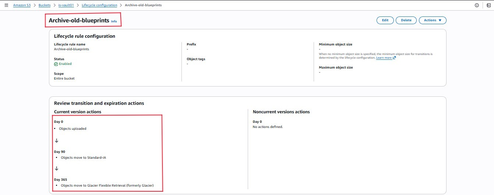
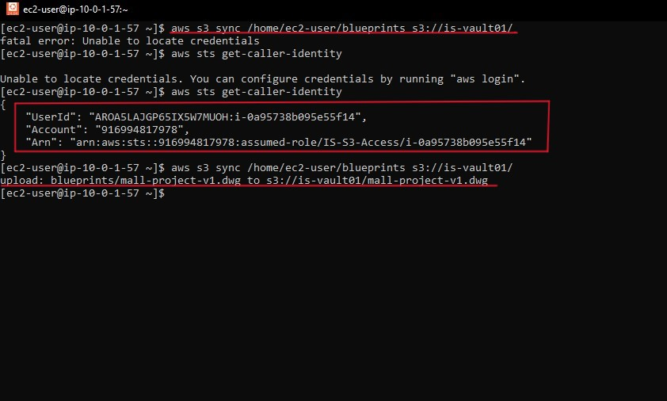
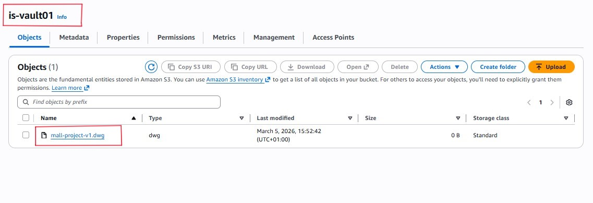

# Objective - Implement a cost-optimised storage strategy.

Architects generate massive files. Keeping 5-year old completed projects on `Standard` storage is an unnecessart expense. This phase outlines the steps taken to set up a cost effective solution.

---

### S3 Lifecycle Management.
I created a bucked named `is-valut01` and implemented Lifecycle transition rules to automate cost savings.
* Active Projects: Remain in S3 Standard for `immediate access`.
* Infrequent Access (Standard-IA): Files move here after `90 days` (Cheaper storage for rarely checked files).
* Long-Term Archive (Glacier): Files move here after `365 days` (Ultra-cheap storage for legal/compliance archiving).

---

### Data Synchronization
To bridge the gap between the Workstation and the Vault, I used the AWS Command Line Interface to sync data.
* The Command: `aws s3 sync /home/ec2-user/blueprints s3://is-vault01/`
* Security Check: Used aws sts get-caller-identity to verify that the EC2 instance had the correct IAM Role permissions to write to the bucket.

* Verify that the workstation and the vault are in sync

