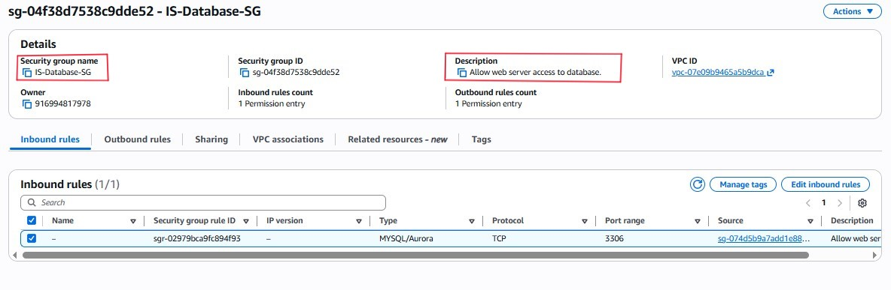
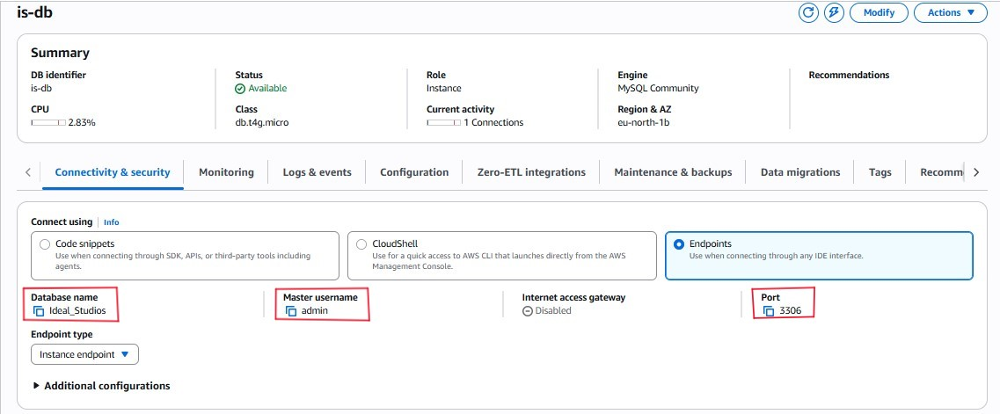
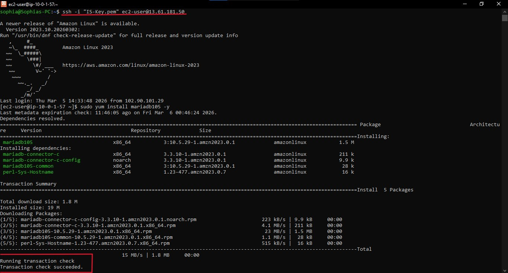
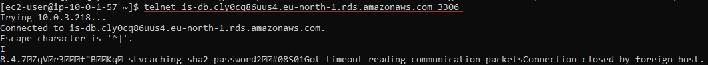

# Objective - Transition from Local storage to Managed RDS

This phases focuses on moving the firm from messy, local Excel spreadsheets to a Managed MySQL Relational Database to ensure data integrity, multi-user concurrency, and high availability.

### 1. Security Group Referencing (The Firewall)
I established a `Zero-Trust` connection between the web tier and the data tier. Instead of opening the database to an IP address, I configured the RDS Security Group to specifically trust the Security Group ID of the Web Server.
* Benefit: If the Web Server's IP changes, the connection remains intact because the "Group" is trusted.

---

### 2. High Availability Subnet Groups
To protect against a data center failure (Availability Zone outage), I forced the database to utilize a Subnet Group spanning two AZs. If one goes dark, the data survives in the other.

---

### 3. Decoupling the Architecture
I launched the `is-db` instance. By moving the data off the EC2 server and into RDS, I decoupled the application.
* Result: If the web server crashes or is deleted, the client list and project budgets remain safe and accessible in the RDS vault.

---

### 4. Testing the Handshake
From the EC2 terminal, I installed the MariaDB client (the "translator") and used telnet to verify the connection to the RDS endpoint on Port 3306.

---

* This indicates a successful use of telnet to verify the connection to the RDS endpoint
  

---

