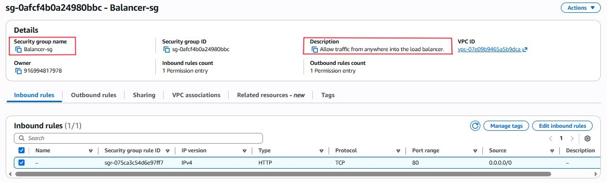
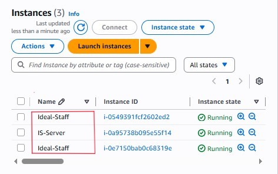

# Objective - Remove the `Single Point of Failure`
If the primary server fails, the system must automatically heal itself and scale to meet user demand.

### 1.The AMI
I created an Amazon Machine Image `AMI`, a perfect snapshot of the configured server. This allows AWS to `clone` the `IS-server` exactly as it is whenever more capacity is needed.

---

### 2. Launch Template & Load Balancer 
* Launch Template: Created the blueprint for new servers using the AMI.
* Elastic Load Balancer `ELB`: Acts as the `Receptionist`. It sits at the front door, receives all incoming traffic, and hands it out to healthy servers.

---

### 3. Auto Scaling Group `ASG`
I configured the ASG to manage the server fleet.
* Self-Healing: If an instance becomes `Unhealthy,` the ASG terminates it and launches a new one automatically.
* Cost Efficiency: For the initial launch, I verified that the ASG could successfully provision instances `Ideal-Staff`, then scaled them back to minimize idle resource costs.

