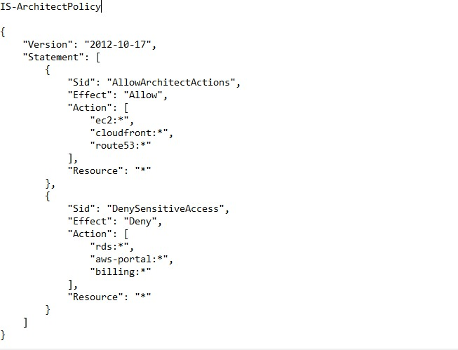
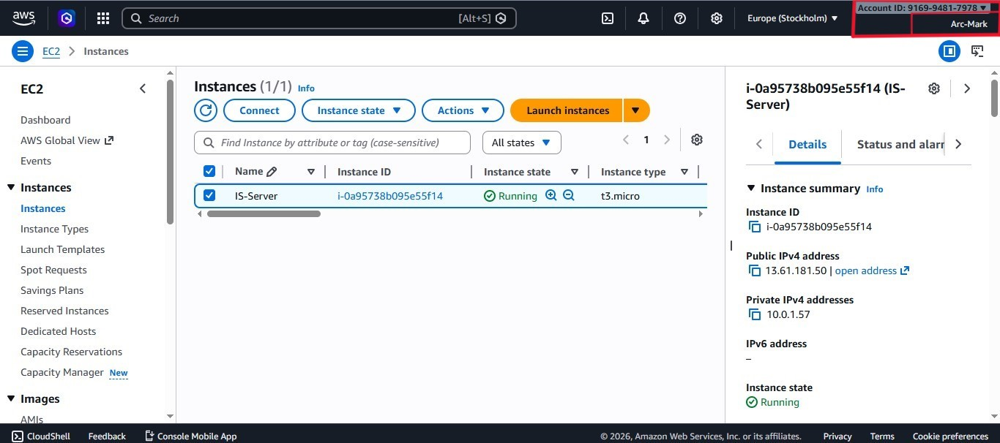
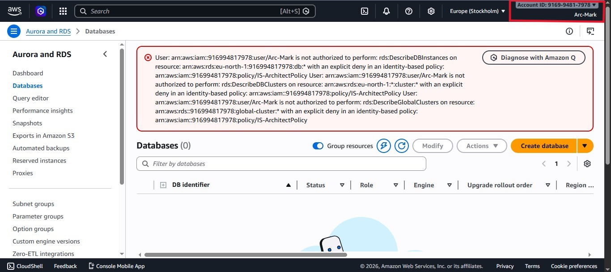

# Objective - To implement a `Least Privilege` model 
This phase focuses on ensuring that staff members only have access to the specific tools they need to perform their jobs, preventing accidental data loss.

### 1. Custom Policy Creation
I moved away from broad `Administrator` access and created a restricted JSON policy specifically for the studio's architects, `IS-ArchitectPolicy`
* The Constraint: Architects are granted full control over Compute (EC2) and Delivery (CloudFront/Route 53), but are strictly forbidden from modifying databases (RDS) or viewing billing data.

--- 

### 2. Enforcement of Separation of Duties
By creating a dedicated Architect-Group, I ensured a safety barrier between the infrastructure layers.
* Benefit: If an architect accidentally deletes a resource, the Persistence Layer (RDS) remains untouched. This `Separation of Duties` effectively prevents accidental data loss and ensures that infrastructure changes do not pose a risk to the studio's core project databases.

* The following screenshots show proof that the above Policy is being enforced by locking `Arc-Mark` out of certain services.

---

