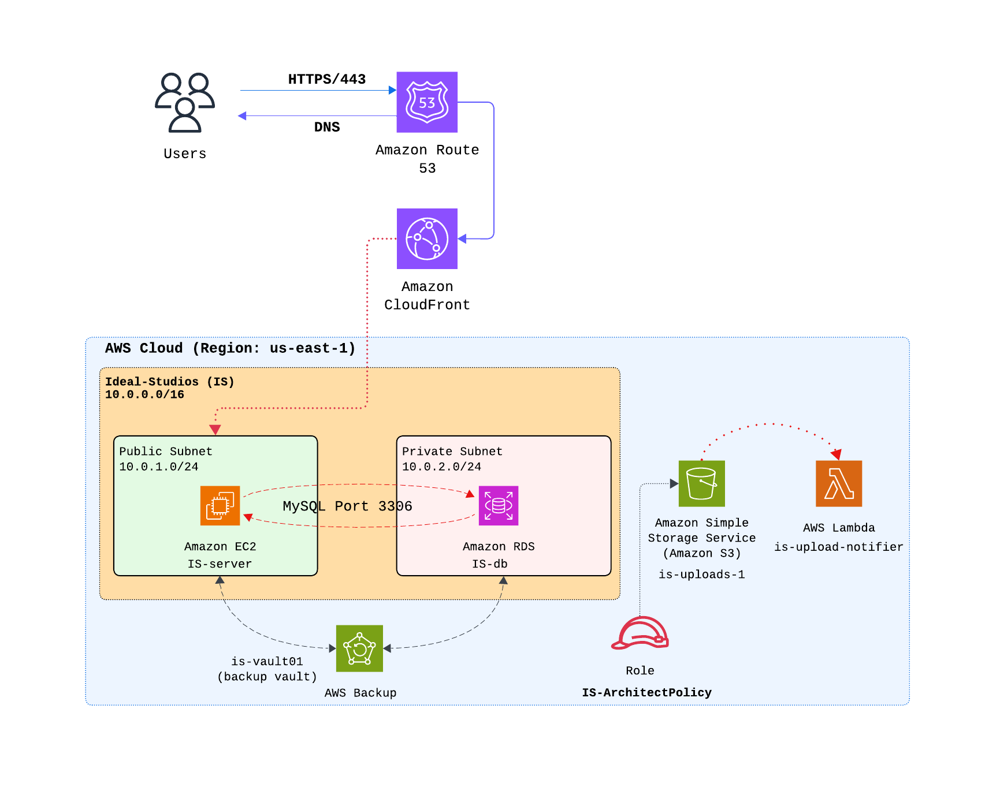

# Ideal Studios Cloud Migration
Ideal Studios is a high-end architectural firm that required a secure, scalable and automated cloud environemt. This project involved migrating their local infrastructure to a 3-tier VPC architecture, implementing global content delivery and setting up event-driven automation for asset mangement.

---

---

With all 10 phases complete, the Ideal Studios cloud infrastructure now stands as a high-performance, secure, and self-healing environment with the following features:
* `Governance`: MFA and Budget Alarms protect the account.

*  `Network`: A 3-tier VPC isolates the database from the public web.

* `Performance`: CloudFront provides global 3D asset acceleration.

*  `Resilience`: Auto Scaling and RDS ensure the studio never stops running.

*  `Automation`: Lambda handles the grunt work.

*  `Safety`: AWS Backup provides the ultimate insurance policy.

 Files 1-X contains the specific steps taken from start to finish in to achieve this.
