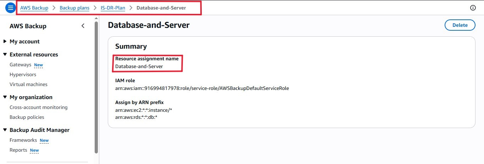

# Objective - To set up recovery points.
This phase details the steps taken to protect Ideal Studios against accidental deletion, ransomware, or regional outages by implementing an automated, centralized backup policy.

### 1. The Centralized Vault `is-vault01`
I initialized a secure Backup Vault to serve as the immutable storage location for all recovery points.
* Security: Access to the vault is strictly controlled via IAM, ensuring that even if a server is compromised, the backups cannot be deleted by an unauthorized user.

### 2. Automated Backup Plans
Instead of manual snapshots, I created an automated Backup Plan.
* Resource Assignment: I tagged the `IS-Server` (EBS Volumes) and `is-db` (RDS) for automatic inclusion.
* Lifecycle Policy: Configured a daily backup schedule with a defined retention period.
* Benefit: This ensures a low `Recovery Point Objective (RPO)`, meaning the studio would lose less than 24 hours of work in a worst-case disaster scenario.
